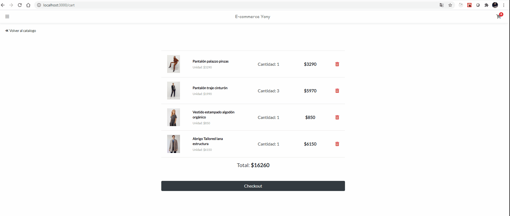

# Ecommerce-Yony

  
  

### Coderhouse curso React JS

  

Para instalar e iniciar el proyecto, se debe correr los siguientes comandos desde el root

    npm install
    npm start

  
  
##### Style

> Para el estilo se utilizo CSS, Styles y Boostrap

##### Módulos NPM extra instalados

     npm install react-bootstrap

> Este modulo fue utilizado exclusivamente para crear un Modal de "verificación".
>Cuando el cliente agrega un item al carrito, se le confirma la acción y se le da opción de ir al "carro" o al "catalogo"

##### HeadingFlujo de Navegación:
Este diagrama indica la navegabilidad de la pagina, desde que se inicia hasta terminar la transacción de compra
  

## Uso de la plataforma
#### Pantalla principal

> 

 - Al entrar a la pagina, el usuario se encontrara con un banner de
   publicidad y las ofertas destacadas hasta el momento.
   >
 -  Desde allí podrá hacer clic en el articulo de su interés y ver mayores detalles del mismo
 - Además, contara con un icono , donde podrá ver en tiempo real la cantidad de ítems adquiridos
 
 gif:
 

#### Sidebar

> El sidebar se accede a través del navbar

 - El cliente encontrara link para "iniciar sesión" donde podrá iniciar o registrarse en la pagina.
 - Se le muestra una lista de categorías, donde podrá filtrar el listado de artículos según su interés
 - Acceso directo a "mi Carro"
 - Link para buscar ordenes según el N° de Boleta. 
gif:

#### Login

> El usuario podrá registrarse proporcionando los datos requeridos (nombre, teléfono, mail)
> Además podrá acceder a través de su cuenta de google, facebook
> El usuario podrá acceder a la pantalla de login y registro desde el sidebar y al momento de hacer checkout.
> Cuando el usuario tiene sus artículos seleccionados, y quiere realizar la compra, en el checkout se le solicita que inicie sesión o ingrese los datos requeridos para finalizar la compra.

#### Cart

> En la vista cart, el cliente vera los artículos seleccionas, su precio unitario y el valor total del carrito.
> Podrá eliminar los artículos no deseados y acceder al checkout

#### Checkout y Finalizar compra

 - Cuando el cliente accede al checkout es porque se decidió adquirir lo
   que esta en el carrito.
   
 - Si el cliente ya ingreso con su usuario, se le mostrara los datos del
   mismo y el botón dirá "finalizar compra como @usuario".
   
 - De lo contrario aparecerá un botón donde le pedirá los datos de
   inicio de sesion o datos para el registro del mismo.
   
 - Luego de finalizada la compra, se le mostrara el numero de Boleta y un link al Home de la pagina
gif:

## MUESTRA FLUJO COMPLETO
