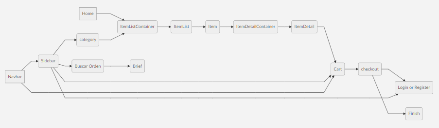

# Ecommerce-Yony

  
  

### Coderhouse curso React JS

  

Para instalar e iniciar el proyecto, se debe correr los siguientes comandos desde el root

    npm install
    npm start

  
  
##### Style

> Para el estilo se utilizo CSS, Styles y Boostrap

##### Modulos NPM extrsa instalados

     npm install react-bootstrap

> Este modulo fue utilizado exclusivamente para crear un Modal de "verificacion".
>Cuando el cliente agrega un item al carrito, se le confirma la acción y se le da opción de ir al "carro" o al "catalogo"

##### HeadingFlujo de Navegación:
Este diagrama indica la navegabilidad de la pagina, desde que se inicia hasta terminar la transacción de compra
  

