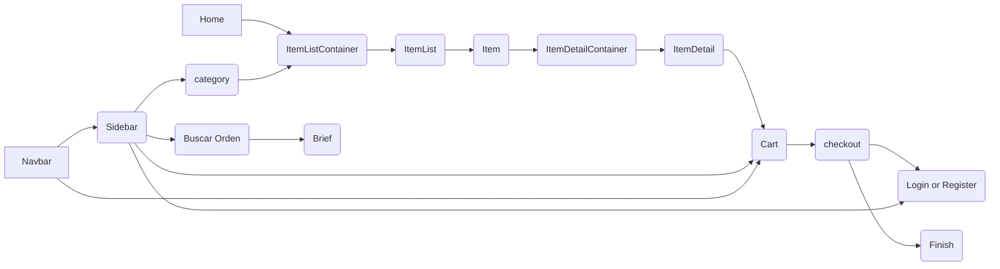

# Ecommerce-Yony

### Coderhouse curso React JS

Para instalar el proyecto se debe correr desde el root

    npm install
    npm start

Flujo de Navegación:

```mermaid
graph LR
C[Home] --> D(ItemListContainer) 
D(ItemListContainer) --> E(ItemList)
E(ItemList) -->F(Item)
F(Item) --> G(ItemDetailContainer) 
G(ItemDetailContainer) --> H(ItemDetail)
H(ItemDetail)--> I(Cart) 
A[Navbar] --> B(Sidebar) 
B(Sidebar) --> K(category)
B(Sidebar) --> M(Search Order)
M(Buscar Orden) --> N(Brief) 
B(Sidebar) --> I(Cart) 
J(checkout) --> L(Login or Register)
J(checkout)  --> O(Finish)
I(Cart) --> J(checkout)
K(category)--> D(ItemListContainer)
A[Navbar]--> I(Cart)
B(Sidebar) -->  L(Login or Register)
```